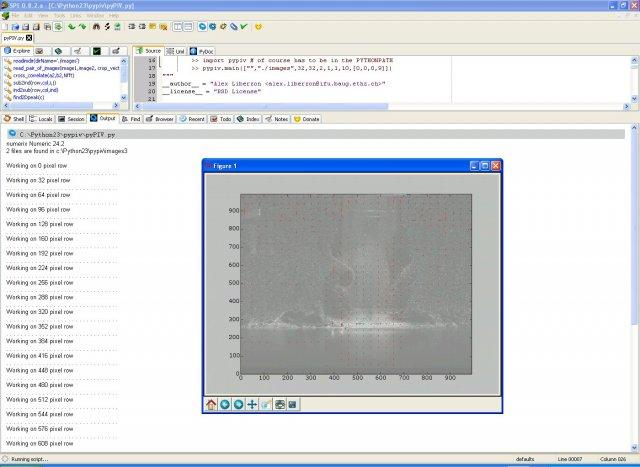
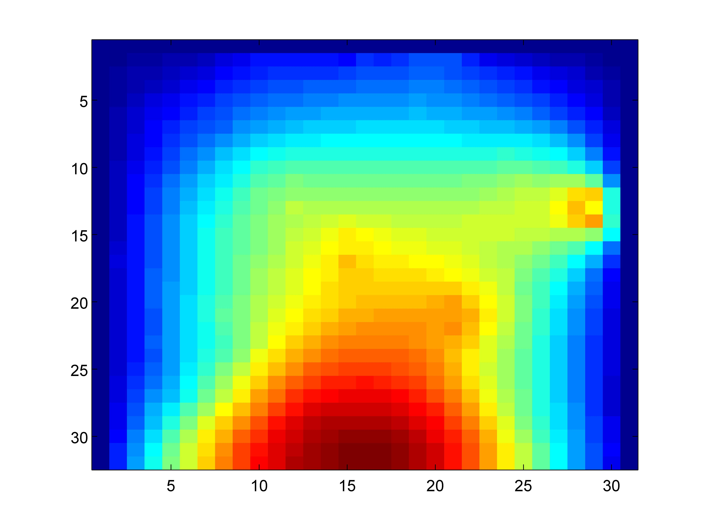

Pressure from PIV
================

Pressure from Particle Image Velocimetry (PIV) data is a sort of a dream of fluid dynamics. Since the flow is fully described 
by the vector field of velocity (the direct result of PIV) and the scalar field of pressure (the main unknown part), if 
we had a trustable method to extract pressure from PIV results, it would cause literally a breakthrough in many areas of 
our life. 

Back in 1999, we suggested to use PIV data in a single plane and apply to the derivatives of velocity the Poisson 
equation. Upon accurate boundary conditions and high quality PIV measurements it is possible to get the fluctuating (!) and 
the mean pressure fields. 

### References
* Our original blog post: http://urapiv.wordpress.com/projects/pressure/
* the scanned conference manuscript in this repository under /docs/ or here [PDF](http://urapiv.files.wordpress.com/2006/02/PIV_99_paper_OCR.pdf)
or here [PDF](http://www.academia.edu/2760232/Computation_of_pressure_distribution_using_PIV_velocity_data)
* If you use this code and the ideas, please cite:  

      Gurka R., Liberzon A., Hefetz D., Rubinstein D. and Shavit U., Computation of Pressure Distribution Using PIV Velocity Data, 3rd International Workshop on Particle Image Velocimetry, Santa Barbara, California, September 16-18, 1999.

### Demo

Starting from the data in the included test folders, e.g. imp_3 (imp is a shortcut for impinging jet experiment), you can get 
a vector field like this:

and the result of the mean pressure looks like this:

